# Q18-G1 icon style trial: emoji vs flat

Ten gap-list products, each rendered in both LoRA styles at two seeds, so the operator can pick a look before it is wired into the icon queue. The operator chooses; this document does not decide for them.

## Operator ruling (2026-09-30)

> "Flat. No faces."

The style is **flat**, and no generated icon may show a face, eyes or a character, in
either style (`emoji` stays available in the code for a possible future use, just not as
the default). `backend/app/services/icon_workflow.py` changed to match:

- `build_icon_workflow`'s `style` parameter now defaults to `"flat"`; passing `style="emoji"`
  explicitly still works exactly as before.
- The negative prompt gained face/character terms, applied to **both** styles: `face, eyes,
  mouth, smile, cartoon character, mascot, anthropomorphic`, alongside the existing `blurry,
  text, watermark`.
- The flat positive prompt already asked for nothing character-like ("flat, `<subject>`,
  simple flat icon, white background"); no wording change was needed there.

This **supersedes** the original "Reading the styles" section below wherever it praises
`emoji`'s aesthetic (that style is no longer the default, and its 3D-face look is exactly
what the ruling rejects) or reads a rendered face/character as acceptable. The rest of that
section's findings — the tiled-pattern failures, the garbled label text, and the Quark
failure in particular — still apply, since none of them were about faces. A "Flat, no
faces" recheck (10 products, flat only, one new seed each, rendered with the updated
template above) is added at the end of the Renders section below.

## Method

Every render used `app.services.icon_workflow.build_icon_workflow` (the frozen graph),
through `app.services.comfyui.render` (the hold protocol), against `a4.comfyui` on the GPU
host, over the SSH tunnel described in the assignment. No IP-Adapter reference image: nodes
9/10/11 were left out, so KSampler samples straight off the LoRA-loaded model.

Fixed graph parameters:

- Checkpoint: `sd_xl_base_1.0.safetensors`
- LoRA: `SDXL-Emoji-Lora-r4.safetensors`
- Canvas: 1024x1024, batch 1
- Sampler: `dpmpp_2m`, scheduler `karras`, cfg 7.0, denoise 1.0, 25 steps
- Negative prompt (original trial below): "blurry, text, watermark". The operator ruling
  above added face/character terms to this for the "Flat, no faces" recheck.
- Background removal: `LoadRembgByBiRefNetModel` (`General.safetensors`) + `RembgByBiRefNet`

Per style:

| Style | Trigger word | LoRA strength used | Allowed range |
| --- | --- | --- | --- |
| emoji | `emoji` | 0.35 | 0.2 - 0.5 |
| flat | `flat` | 0.75 | 0.7 - 0.8 |

Two fixed seeds per style (20260930, 20260931), chosen for a reproducible side-by-side
rather than a representative sample.

First job (cold start included): 22.1s. Later jobs measure steady-state render time only.

## Renders

### Tomato puree

| | seed 20260930 | seed 20260931 |
| --- | --- | --- |
| emoji (256px) | 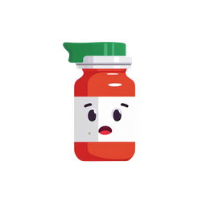 | 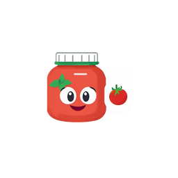 |
| flat (256px) | 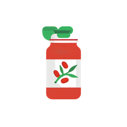 | 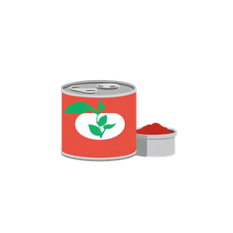 |

| emoji (64px) | 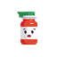 | 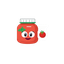 |
| flat (64px) | 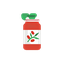 |  |

Timings: emoji/20260930 22.1s, emoji/20260931 22.8s, flat/20260930 24.9s, flat/20260931 23.0s

### Canned tuna

| | seed 20260930 | seed 20260931 |
| --- | --- | --- |
| emoji (256px) | 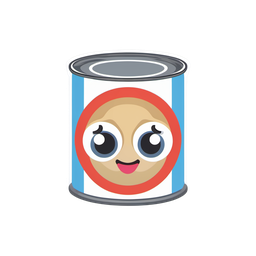 | 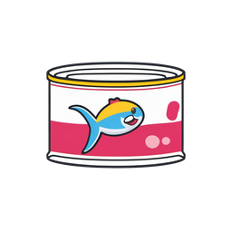 |
| flat (256px) | 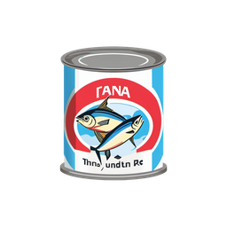 | 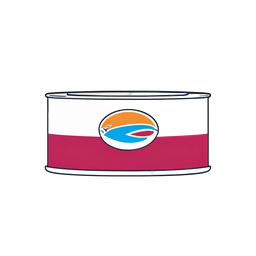 |

| emoji (64px) |  |  |
| flat (64px) |  |  |

Timings: emoji/20260930 24.4s, emoji/20260931 22.9s, flat/20260930 24.9s, flat/20260931 22.9s

### Fish fingers

| | seed 20260930 | seed 20260931 |
| --- | --- | --- |
| emoji (256px) | 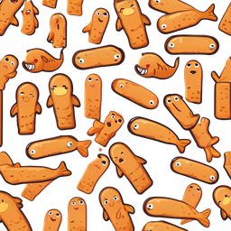 | 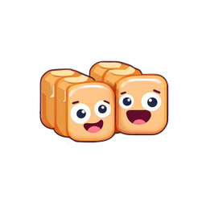 |
| flat (256px) |  | 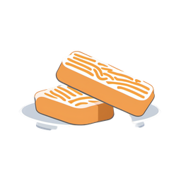 |

| emoji (64px) |  |  |
| flat (64px) |  |  |

Timings: emoji/20260930 24.9s, emoji/20260931 23.0s, flat/20260930 24.9s, flat/20260931 22.9s

### Canned tomatoes

| | seed 20260930 | seed 20260931 |
| --- | --- | --- |
| emoji (256px) | 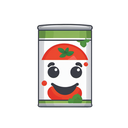 | 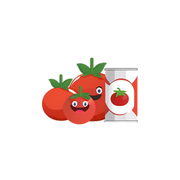 |
| flat (256px) | 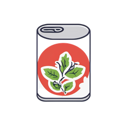 | 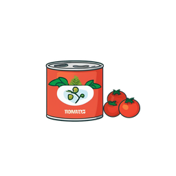 |

| emoji (64px) |  | 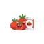 |
| flat (64px) |  | 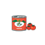 |

Timings: emoji/20260930 24.9s, emoji/20260931 23.0s, flat/20260930 24.3s, flat/20260931 22.4s

### Quark

| | seed 20260930 | seed 20260931 |
| --- | --- | --- |
| emoji (256px) |  |  |
| flat (256px) |  | 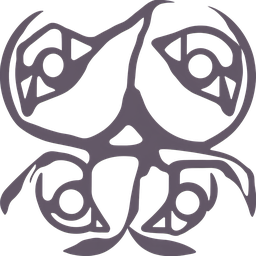 |

| emoji (64px) |  |  |
| flat (64px) | 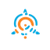 |  |

Timings: emoji/20260930 24.9s, emoji/20260931 23.0s, flat/20260930 24.4s, flat/20260931 22.9s

### Mozzarella

| | seed 20260930 | seed 20260931 |
| --- | --- | --- |
| emoji (256px) | 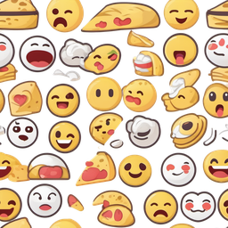 |  |
| flat (256px) | 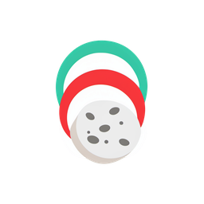 | 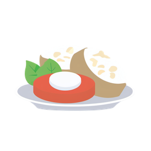 |

| emoji (64px) |  |  |
| flat (64px) |  |  |

Timings: emoji/20260930 24.1s, emoji/20260931 22.5s, flat/20260930 24.4s, flat/20260931 22.7s

### Minced beef

| | seed 20260930 | seed 20260931 |
| --- | --- | --- |
| emoji (256px) | 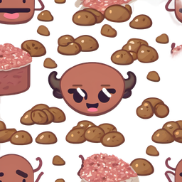 |  |
| flat (256px) | 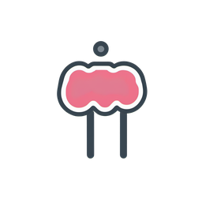 | 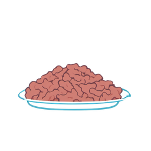 |

| emoji (64px) | 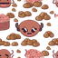 |  |
| flat (64px) |  | 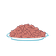 |

Timings: emoji/20260930 24.8s, emoji/20260931 22.8s, flat/20260930 24.8s, flat/20260931 22.8s

### Parsnip

| | seed 20260930 | seed 20260931 |
| --- | --- | --- |
| emoji (256px) |  | 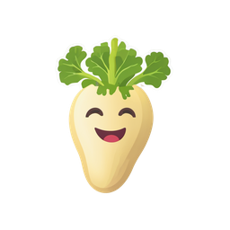 |
| flat (256px) | 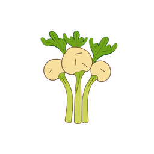 | 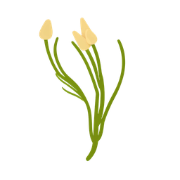 |

| emoji (64px) |  |  |
| flat (64px) |  |  |

Timings: emoji/20260930 24.5s, emoji/20260931 22.7s, flat/20260930 24.7s, flat/20260931 23.2s

### Karelian pasty

| | seed 20260930 | seed 20260931 |
| --- | --- | --- |
| emoji (256px) | 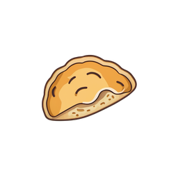 |  |
| flat (256px) |  | 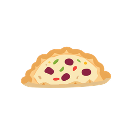 |

| emoji (64px) |  |  |
| flat (64px) |  |  |

Timings: emoji/20260930 24.7s, emoji/20260931 23.0s, flat/20260930 24.9s, flat/20260931 22.6s

### Oat drink

| | seed 20260930 | seed 20260931 |
| --- | --- | --- |
| emoji (256px) | 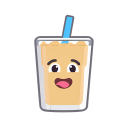 |  |
| flat (256px) | 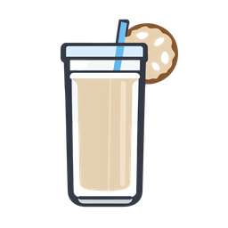 | 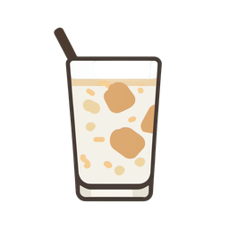 |

| emoji (64px) |  |  |
| flat (64px) |  |  |

Timings: emoji/20260930 24.6s, emoji/20260931 22.3s, flat/20260930 24.9s, flat/20260931 23.0s

### Flat, no faces (recheck, seed 20261001)

Rendered after the operator ruling above, with the updated template (`style` defaulting to
`flat`, the face/character terms added to the negative prompt): the same 10 products, flat
only, one new seed each (10 renders, not 40 - no `emoji` and no second seed, since the
question this recheck answers is only "does the new template keep faces out").

| Product | 256px | 64px |
| --- | --- | --- |
| Tomato puree | 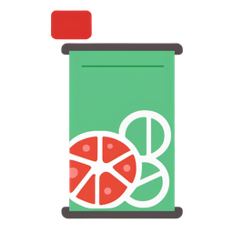 | 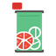 |
| Canned tuna | 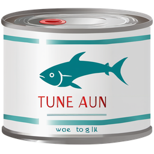 | 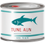 |
| Fish fingers | 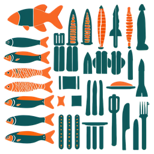 |  |
| Canned tomatoes | 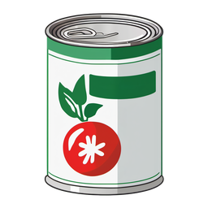 |  |
| Quark | 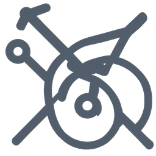 |  |
| Mozzarella | 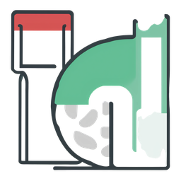 |  |
| Minced beef | 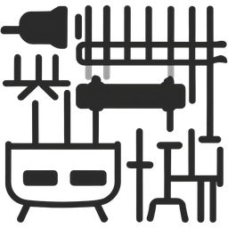 |  |
| Parsnip | 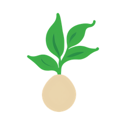 | 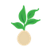 |
| Karelian pasty | 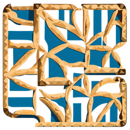 |  |
| Oat drink |  |  |

Timings: Tomato puree 50.3s (cold start - GPU had unloaded since the earlier trial), Canned
tuna 22.9s, Fish fingers 22.9s, Canned tomatoes 22.9s, Quark 22.9s, Mozzarella 22.9s, Minced
beef 22.9s, Parsnip 22.7s, Karelian pasty 23.0s, Oat drink 22.9s. 10/10 renders ok, no
protocol failures.

**No faces, eyes or characters appeared in any of the 10 renders.** The ruling's specific
requirement is met cleanly and consistently - this is the headline result of the recheck.

Everything else about the earlier "Reading the styles" section's account of `flat`'s
non-face failure modes still holds, and this recheck adds direct evidence:

- **Clean and on-subject (6/10):** Tomato puree, Canned tomatoes, Parsnip, Oat drink read
  well at both sizes. Canned tuna is also on-subject but keeps the pre-existing **text
  artefact** ("TUNE AUN", "wae to g lk" on the label) - a known SDXL weakness, not related
  to faces.
- **Tiled/repeating-pattern failure, still present without faces (2/10):** Fish fingers and
  Karelian pasty both came back as a repeating decorative pattern rather than a single
  centred object - the same compositional failure mode the original trial saw on some
  `emoji` renders, now confirmed on `flat` too with a fresh seed. Unreadable at 64px in both
  cases.
- **Quark fails again, a third seed in a row:** an abstract line-art mark with no visual
  connection to curd cheese - the same failure as both original seeds in both styles. This
  is now 3/3 seeds tested across both styles. Confirms the earlier finding: Quark needs a
  more descriptive subject string or a reference image, not a style or seed change.
- **Mozzarella and Minced beef are abstract, not clearly on-subject** at this seed (an
  ambiguous container/texture shape, and what reads more like kitchen-tool line icons than
  meat, respectively) - milder than a full failure, but neither would pass as a recognisable
  product icon as rendered.

Net: the operator's "no faces" bar is met 10/10. The product-recognisability bar from the
original trial is not solved by the template change (it was never meant to be) - Quark still
needs a different subject or a reference image, and the tiled-pattern failure is a
per-seed instability independent of the faces fix. **Regenerate with a new seed** (next
round) is the practical mitigation already planned for exactly this.

## Failures (0)

None. (10/10 renders in the original trial and 10/10 in the recheck completed without a
protocol error; the quality issues above - Quark, the tiled patterns, the text artefact -
are not client/protocol failures.)

## Reading the styles

> **Superseded by the operator ruling above** wherever it reads a rendered face as
> acceptable, or weighs `emoji`'s 3D-face look as a point in its favour - the ruling rejects
> faces outright, so `emoji`'s aesthetic strength here no longer counts as one. The
> non-face findings (the tiled-pattern failures, the text artefacts, and Quark) are
> unaffected and still stand, and are confirmed again by the recheck above.

All 40 renders came back technically clean (a valid transparent PNG each, no protocol
failures), but several are unusable as a product icon. Judged by eye against every table
above, at both 256px and 64px:

**emoji (0.35)** gives the nicer "Apple-emoji-adjacent" look when it works: a soft 3D
rounded object with a cute face, close in spirit to the real emoji set (Tomato puree, Canned
tomatoes, Parsnip, Karelian pasty, Oat drink, Canned tuna, and one of the two Fish fingers
seeds all read cleanly at both sizes). Its failure mode is severe and specific: on a subject
the LoRA cannot visually ground - **Quark** (both seeds), **Mozzarella** (both seeds),
**Minced beef** (seed 20260930), and **Fish fingers** (seed 20260930) - it stops drawing the
product at all and instead tiles a repeating pattern of small, unrelated emoji faces (Quark),
a cheese/pizza-emoji collage (Mozzarella), a bull's-head emoji among meat clumps (Minced
beef), or duplicated fish-finger characters (Fish fingers/20260930). At 64px these collapse
into an indistinct textured blob - unreadable, and worse, actively misleading (it does not
even look like a placeholder, it looks like a decorative pattern). This is not rare: 4 of 10
products showed it on at least one seed.

**flat (0.75)** is more consistent: every product produced a single, centred, identifiable
object at both sizes, including the four that broke emoji style (Quark is the one exception -
see below). Its two failure modes are milder and more typical of SDXL: (1) **text
artefacts** - Canned tuna's label carries garbled pseudo-Cyrillic/Latin glyphs
("ГANA", "Thnq undtn Rc") despite "text" being in the negative prompt, most visible at 256px
and reading as generic noise rather than obviously-wrong text at 64px; and (2) **drifted
label content** - Canned tomatoes/seed 20260930 draws a leaf/herb sprig on the label instead
of tomatoes (the can shape itself is still correct), while seed 20260931 on the same product
gets both the can and a readable "TOMATOES" label right, so this is seed variance rather than
a systematic miss.

**Quark is a shared failure, not a style difference.** Both styles, both seeds render an
abstract logo/mark with no visual connection to curd cheese - the bare word "quark" gives the
model nothing food-shaped to draw, so it falls back to the LoRA's own generic training
distribution (which, being an *emoji* LoRA, defaults to faces and abstract marks rather than
inventing a plausible food). This is a subject-text problem, not a style problem: a more
descriptive subject ("a tub of quark, soft white curd cheese") or the next round's IP-Adapter
reference image is likely required for Quark regardless of which style the operator picks.

Net read: **flat sits better next to Apple emoji on reliability** - it never produced the
tiled-pattern failure and stayed on-subject for 9 of 10 products - at the cost of occasional
text noise that is a smaller visual problem than a wrong picture entirely. **emoji sits
better on aesthetic fit** to the rounded 3D Apple look when it lands, but its failure rate
(4/10 products with at least one bad seed) is too high to ship without either regenerating
failed products by hand or wiring the per-product Regenerate the next round adds.

## Recommended LoRA strength

Both styles were only tried at their spec-default strength here (this trial varied style and
seed, not strength), so there is no measured basis yet for moving off the defaults:

- **emoji: keep 0.35.** The allowed range is 0.2-0.5; nothing observed here suggests more
  LoRA strength would fix the tiled-pattern failures, since those look like a subject-grounding
  problem (see Quark above) rather than a "not enough style" problem. Worth an exploratory
  render at 0.5 next round on a product that failed at 0.35, but not blocking.
- **flat: keep 0.75.** The allowed range is 0.7-0.8; the text artefacts are a known SDXL
  weakness at any strength in this range, not obviously tied to strength. 0.8 might be worth
  a spot-check for sharper linework, but 0.75 already produced clean, single-subject icons for
  9 of 10 products.

The operator has since ruled on the style (flat, no faces - see above); the strength
recommendation for `flat` (keep 0.75) stands unchanged by that ruling, since the recheck
used the same 0.75 and produced the same mix of clean and imperfect results.

## Next round

Not implemented here. Wiring this into the product icon queue still needs:
- PNG storage for a generated icon (where product_icons.py's SVGs live now, or a sibling column/table - out of this lane's scope, see product_icons.py).
- Queue integration: call `build_icon_workflow` (now `flat` by default, per the ruling) + `comfyui.render` for each gap product.
- A per-product Regenerate action that renders again with a new random seed - the recheck shows this is not cosmetic: Fish fingers, Karelian pasty, Mozzarella and Minced beef all need a re-roll before they are usable, and this is the mechanism for it.
- A better subject string or an IP-Adapter reference image for Quark specifically (3/3 seeds across both styles have failed on it; it is not a seed problem).
- Setting `COMFYUI_BASE_URL` in the real stack once the Kyokki server can reach the GPU host (a media-gateway is planned; see the assignment's Access section).

