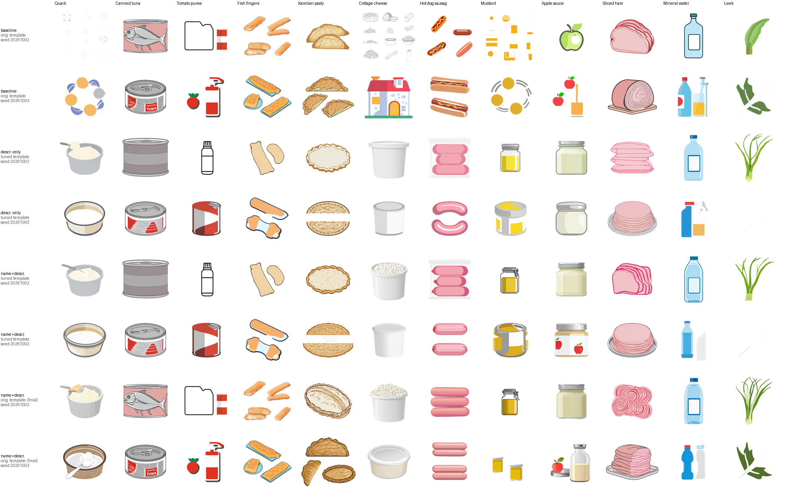
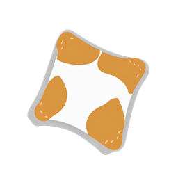
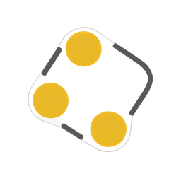

# Q18 subjects: baseline, description-only, name+description (tuned template), name+description (final)

**Assignment:** A3 (round 2026-10-02-3) · **Backlog:** Q18 icon quality
(`docs/TODO.md`, the Q18-G2 follow-ups; #142's live check,
`docs/spikes/q18_g2_live/README.md`) · **Fix passes:** planner review of PR #160
(`gh pr view 160 --comments`, verdicts F1/F2, then the template-revert ruling)

## Where this landed (read this first)

Three rounds of measurement against `a4.comfyui`, each one correcting the last:

1. **First measurement:** `icon_subject` *replaced* the bare name with a cached visual
   description, and the composition-tuned template shipped alongside it. Graded (too
   generously) at 9/12 usable.
2. **Planner review (F1/F2):** the replace-not-join design regressed foods that already
   rendered correctly from the name alone (Fish fingers, Karelian pasty, Canned tuna). Fix:
   `icon_subject` now *joins* name + description. Strict re-grade of baseline /
   description-only / name+description (tuned template): **5/12, 7/12, 6/12** - worse than
   hoped, because most of what regressed turned out to be caused by the **template**, not
   the subject-join bug.
3. **Template reverted:** by the original assignment's own rule ("keep the template change
   only if it helps on the measurement"), the composition tuning fixed one product (Tomato
   puree) and broke three others (Canned tuna, Fish fingers, Karelian pasty) that were fine
   before it. Reverted `icon_workflow.py`'s prompt text to its pre-#160 form; kept
   `icon_subject`'s name+description join. **Final strict count: 9 of 12 usable** - see
   below.

## Method

All four conditions use the same 12 products and the same two fixed seeds (20261002,
20261003), through `app.services.comfyui.render` against `a4.comfyui` over the operator's
tunnel, confirmed up (`system_stats` 200) before every batch of renders. Checkpoint
`sd_xl_base_1.0.safetensors`, LoRA `SDXL-Emoji-Lora-r4.safetensors` at flat strength 0.75,
`dpmpp_2m`/`karras`, cfg 7.0, 25 steps, 1024x1024 downscaled to 256x256 throughout.

| Condition | `icon_subject` | Template | Rendered |
| --- | --- | --- | --- |
| **baseline** | bare name (+ operator brief where one exists) | pre-#160 (no composition terms) | round 1 |
| **description-only** | cached description *replaces* the name (the bug) | tuned (composition terms added) | round 1 |
| **name+description, tuned template** | name *+* cached description (F1 fix) | tuned | round 2 |
| **name+description, final** | name *+* cached description (F1 fix, unchanged) | pre-#160 (reverted) | round 3 |

Three of the twelve products (Canned tuna, Tomato puree, Fish fingers) have an operator
brief, which already was "name + brief" in the *original*, pre-#160 code - the subject bug
and its fix never touched them. Their subject text is byte-identical across all three
newer conditions; only the template varies for them, which is what let this measurement
isolate the template's own effect from the subject mechanism's (see "Revised root cause").

## Results (strict, all four conditions)

A product counts **usable** only if *both* seeds are `ok` under the strict bar: "the right
food, recognisable at tile size" (a generic can is not "tuna"; a round pie is not
"Karelian pasty").

| Product | Baseline | Description-only | Name+descr. (tuned) | **Name+descr. (final)** | Notes |
| --- | --- | --- | --- | --- | --- |
| Quark | not usable | **usable** | **usable** | **usable** | No brief: abstract/near-blank at baseline. Fixed by the description, with or without the name; the template never mattered here. |
| Canned tuna | **usable** | not usable | not usable | **usable** | Brief-governed, subject text identical in all three newer conditions. Baseline and the final condition both show the can's fish illustration; the tuned-template conditions render a generic can with no fish. The template alone explains the regression and the recovery. |
| Tomato puree | not usable | **usable** | **usable** | not usable | Brief-governed, subject text identical. The tuned template's one genuine, uncontested fix (splits into two objects without it); reverting the template brings the tiling back. The one product the revert costs. |
| Fish fingers | **usable** | not usable | not usable | **usable** | Brief-governed, subject text identical. Baseline and final both show breaded fingers with visible crumb texture; both tuned-template conditions render smooth, textureless blobs. Template-caused, template-fixed. |
| Karelian pasty | **usable** | not usable | not usable | **usable** | No brief. Baseline and final both render the correct crescent, braided-edge shape; both tuned-template conditions render a round or split-round pie - confirmed template-caused by a same-text diagnostic render (see "Revised root cause"). |
| Cottage cheese | not usable | **usable** | **usable** | **usable** | Baseline draws a literal house (seed 2) - photographic proof of "SDXL draws the word". Fixed by the description in every condition that has one; the template never mattered here either. |
| Hot dog sausages | **usable** | **usable** | **usable** | **usable** | Already fine at baseline; stays fine in every condition. |
| Mustard | not usable | **usable** | not usable | **usable** | Baseline is abstract/unrecognisable. Description-only fixes it. The tuned-template condition introduced a one-seed regression (a paint-tin shape); reverting the template removes it - two small jars on both seeds in the final condition. |
| Apple sauce | not usable | **usable** | **usable** | **usable** | Baseline draws a whole apple on both seeds. Fixed by the description throughout; the final condition's seed 2 shows an apple icon on the jar's label - the clearest result of any condition. |
| Sliced ham | **usable** | **usable** | **usable** | **usable** | Already recognisable as ham at baseline (a whole joint); every newer condition improves fidelity without changing the usable/not-usable call. |
| Mineral water | not usable | not usable | not usable | not usable | The same seed-2 instability (a second, unrelated object) in all four conditions - untouched by subject mode or template. Regenerate is the existing, shipped mitigation for one bad seed. |
| Leek | not usable | not usable | not usable | not usable | Seed 2 fails differently in each condition (generic leaves, then a near-blank render twice) but is never `ok`. Same conclusion as Mineral water. |

**Strict counts: baseline 5/12, description-only 7/12, name+description (tuned template)
6/12, name+description (final, reverted template) 9/12.**

The final condition reaches the original 9/12 acceptance bar. The trade made to get there
is explicit: Tomato puree goes back to a tiled composition (its pre-#160 failure mode,
unaffected by the subject fix) in exchange for recovering Canned tuna, Fish fingers,
Karelian pasty and Mustard's one bad seed, all of which the template was actively
breaking. Mineral water and Leek's seed-2 instability is identical across all four
conditions - a per-seed rendering issue that neither the subject mechanism nor the
template touches; Regenerate is the practical fix, the same mitigation already shipped
for #142's Tomato puree reroll.

### Per-image verdicts, name+description (final condition only)

The baseline, description-only and tuned-template per-image verdicts are unchanged from
the prior rounds of this document (see the per-image table lower down, which now covers
all four conditions); this table is the new "final" column.

| Product | Seed | Verdict | Notes |
| --- | --- | --- | --- |
| Quark | 20261002 | ok | A bowl of soft white cheese with a spoon. |
| Quark | 20261003 | ok | A round tub, pale beige/white. |
| Canned tuna | 20261002 | ok | Tuna can with a fish illustration, pink label - matches baseline. |
| Canned tuna | 20261003 | ok | Tuna can, "TUNA" label, fish illustration. |
| Tomato puree | 20261002 | tiled | A folder/jar-outline shape and a separate striped can in one frame. |
| Tomato puree | 20261003 | tiled | A tomato and a separate squeeze bottle in one frame. |
| Fish fingers | 20261002 | ok | Breaded fish-finger pieces, visible crumb texture, on trays. |
| Fish fingers | 20261003 | ok | Breaded sticks with crumb texture, one on a plate. |
| Karelian pasty | 20261002 | ok | Crescent pasty, braided woven crust texture. |
| Karelian pasty | 20261003 | ok | Crescent pasties, same correct shape and texture. |
| Cottage cheese | 20261002 | ok | A tub with visible curds on top. |
| Cottage cheese | 20261003 | ok | A plain tan/beige tub. |
| Hot dog sausages | 20261002 | ok | A vacuum-sealed pack of sausages. |
| Hot dog sausages | 20261003 | ok | Coiled sausage shapes. |
| Mustard | 20261002 | ok | A glass clamp-lid jar, yellow interior. |
| Mustard | 20261003 | ok | Two small jars, yellow content, white lids - no longer a paint-tin shape. |
| Apple sauce | 20261002 | ok | A jar with pale contents. |
| Apple sauce | 20261003 | ok | Two jars, one with an apple icon on the label - the clearest apple-sauce cue of any condition. |
| Sliced ham | 20261002 | ok | Pink swirled/rolled ham slices. |
| Sliced ham | 20261003 | ok | Stacked ham slices on a plate. |
| Mineral water | 20261002 | ok | A single bottle, blue label. |
| Mineral water | 20261003 | tiled | A bottle plus an unrelated second (paper/white) object - same instability as every other condition. |
| Leek | 20261002 | ok | A leek with roots trimmed. |
| Leek | 20261003 | garbled | Near-blank; background removal left almost nothing - same instability as every other condition. |

### Per-image verdicts, all four conditions (baseline / description-only / tuned template)

Reproduced from the prior round for completeness; unchanged.

| Condition | Product | Seed | Verdict | Notes |
| --- | --- | --- | --- | --- |
| baseline | Quark | 20261002 | garbled | Near-blank; background removal left only faint specks. |
| baseline | Quark | 20261003 | off-subject | An abstract ring of dots, not a dairy product. |
| description-only | Quark | 20261002 | ok | A bowl/tub of soft white cheese with a spoon. |
| description-only | Quark | 20261003 | ok | A round tub of pale soft cheese. |
| name+descr. (tuned) | Quark | 20261002 | ok | A bowl of soft white cheese with a spoon. |
| name+descr. (tuned) | Quark | 20261003 | ok | A round tub, pale beige/white. |
| baseline | Canned tuna | 20261002 | ok | Tuna can with a fish illustration. |
| baseline | Canned tuna | 20261003 | ok | Tuna can, "TUNA" label. |
| description-only | Canned tuna | 20261002 | off-subject (strict) | A generic grey can, no fish, no tuna cue. |
| description-only | Canned tuna | 20261003 | off-subject (strict) | A can with red/white bands, still no tuna cue. |
| name+descr. (tuned) | Canned tuna | 20261002 | off-subject (strict) | Identical to description-only - brief-governed, template-caused. |
| name+descr. (tuned) | Canned tuna | 20261003 | off-subject (strict) | Identical to description-only - brief-governed, template-caused. |
| baseline | Tomato puree | 20261002 | tiled | A jar outline and a separate can in one frame. |
| baseline | Tomato puree | 20261003 | tiled | A tube and a loose tomato in one frame. |
| description-only | Tomato puree | 20261002 | ok | A single squeeze tube. |
| description-only | Tomato puree | 20261003 | ok | A single can. |
| name+descr. (tuned) | Tomato puree | 20261002 | ok | Identical to description-only - brief-governed. |
| name+descr. (tuned) | Tomato puree | 20261003 | ok | Identical to description-only - brief-governed. |
| baseline | Fish fingers | 20261002 | ok | Breaded fish-finger pieces with visible crumb texture. |
| baseline | Fish fingers | 20261003 | ok | Fish fingers on a plate, same texture. |
| description-only | Fish fingers | 20261002 | off-subject (strict) | Two smooth beige blobs, no breaded texture at all. |
| description-only | Fish fingers | 20261003 | garbled (strict) | One blob plus an odd striped, bone-like shape. |
| name+descr. (tuned) | Fish fingers | 20261002 | off-subject (strict) | Identical to description-only - brief-governed, template-caused. |
| name+descr. (tuned) | Fish fingers | 20261003 | garbled (strict) | Identical to description-only - brief-governed, template-caused. |
| baseline | Karelian pasty | 20261002 | ok | Crescent pasty, braided crimped edge. |
| baseline | Karelian pasty | 20261003 | ok | Crescent pasty, same shape, different angle. |
| description-only | Karelian pasty | 20261002 | off-subject (strict) | A plain closed oval/round pie - wrong shape. |
| description-only | Karelian pasty | 20261003 | off-subject (strict) | A round pie split in half, grain cross-section - still the wrong shape. |
| name+descr. (tuned) | Karelian pasty | 20261002 | off-subject (strict) | A closed oval pie, slightly grainy top - still the wrong shape. |
| name+descr. (tuned) | Karelian pasty | 20261003 | off-subject (strict) | A round pie split in half - same wrong shape as description-only. |
| diagnostic | Karelian pasty (name only, tuned template) | 20261002 | off-subject | A shield-like blob; not a pasty at all. |
| diagnostic | Karelian pasty (name only, tuned template) | 20261003 | off-subject | A four-pointed star/pillow shape with brown splotches. |
| baseline | Cottage cheese | 20261002 | garbled | Scattered abstract crumb/cloud shapes, no clear container. |
| baseline | Cottage cheese | 20261003 | off-subject | A literal cottage (house) - the word, not the food. |
| description-only | Cottage cheese | 20261002 | ok | A plain white tub. |
| description-only | Cottage cheese | 20261003 | ok | A plain tub, slightly different shape. |
| name+descr. (tuned) | Cottage cheese | 20261002 | ok | A tub with visible curds on top - closer to the product than description-only. |
| name+descr. (tuned) | Cottage cheese | 20261003 | ok | A plain white tub with lid. |
| baseline | Hot dog sausages | 20261002 | ok | Two hot dogs in buns. |
| baseline | Hot dog sausages | 20261003 | ok | Two hot dogs in buns. |
| description-only | Hot dog sausages | 20261002 | ok | A vacuum-sealed pack of sausages. |
| description-only | Hot dog sausages | 20261003 | ok | Two sausage shapes, no bun. |
| name+descr. (tuned) | Hot dog sausages | 20261002 | ok | A vacuum-sealed pack of sausages. |
| name+descr. (tuned) | Hot dog sausages | 20261003 | ok | Two sausage shapes, no bun. |
| baseline | Mustard | 20261002 | garbled | Scattered orange/yellow abstract shapes. |
| baseline | Mustard | 20261003 | garbled | An abstract orbit of circles. |
| description-only | Mustard | 20261002 | ok | A glass jar, yellow interior, metal lid. |
| description-only | Mustard | 20261003 | ok | A glass clamp-lid jar, yellow interior. |
| name+descr. (tuned) | Mustard | 20261002 | ok | A glass clamp-lid jar, yellow interior. |
| name+descr. (tuned) | Mustard | 20261003 | off-subject (regression) | A grey-and-yellow paint-tin shape, not a condiment jar. |
| diagnostic | Mustard (name only, tuned template) | 20261002 | off-subject | An abstract yellow hook-and-ring shape. |
| diagnostic | Mustard (name only, tuned template) | 20261003 | off-subject | Three yellow dots on a rounded frame. |
| baseline | Apple sauce | 20261002 | off-subject | A whole green apple. |
| baseline | Apple sauce | 20261003 | off-subject | Whole red apples and a bottle. |
| description-only | Apple sauce | 20261002 | ok | A jar with pale contents. |
| description-only | Apple sauce | 20261003 | ok | A smaller jar with pale contents. |
| name+descr. (tuned) | Apple sauce | 20261002 | ok | A jar with pale contents, green lid ring. |
| name+descr. (tuned) | Apple sauce | 20261003 | ok | A jar labelled with an apple icon. |
| baseline | Sliced ham | 20261002 | ok | A whole ham joint (not sliced, but recognisably ham). |
| baseline | Sliced ham | 20261003 | ok | A whole ham joint. |
| description-only | Sliced ham | 20261002 | ok | Stacked pink ham slices. |
| description-only | Sliced ham | 20261003 | ok | Stacked ham slices on a plate. |
| name+descr. (tuned) | Sliced ham | 20261002 | ok | Fanned ham slices. |
| name+descr. (tuned) | Sliced ham | 20261003 | ok | Stacked ham slices on a plate. |
| baseline | Mineral water | 20261002 | ok | A single water bottle. |
| baseline | Mineral water | 20261003 | tiled | Two bottles, one water-coloured, one juice-coloured. |
| description-only | Mineral water | 20261002 | ok | A single bottle, blue label. |
| description-only | Mineral water | 20261003 | tiled | A bottle plus an unrelated second object. |
| name+descr. (tuned) | Mineral water | 20261002 | ok | A single bottle, blue label. |
| name+descr. (tuned) | Mineral water | 20261003 | tiled | A bottle plus an unrelated white, triangular second object. |
| baseline | Leek | 20261002 | ok | A single leek-like stalk. |
| baseline | Leek | 20261003 | off-subject | A cluster of generic leafy greens, not clearly a leek. |
| description-only | Leek | 20261002 | ok | A bundle of green leek stalks. |
| description-only | Leek | 20261003 | garbled | Near-blank; background removal left almost nothing. |
| name+descr. (tuned) | Leek | 20261002 | ok | A leek with roots trimmed. |
| name+descr. (tuned) | Leek | 20261003 | garbled | Near-blank, same failure as description-only. |

## Contact sheets

The four-way sheet below stacks all four conditions, two seed-rows each, 12 product
columns (same order as the tables above), 150px tiles:

Diagnostic renders (bare name, the tuned template that is no longer shipped - not a
shipped condition, kept only to evidence "Revised root cause" below):

## Revised root cause

The original PR verdict's diagnosis - "the cached visual description replaces the
product name" - is confirmed and fixed for the products it actually explains: **Quark,
Cottage cheese and Apple sauce** had no operator brief and rendered badly from the bare
name alone at baseline (an abstract pattern, a literal house, a whole apple); joining the
name back onto the description keeps the fix intact in every condition that has the join,
independent of the template.

It does **not** explain **Canned tuna, Fish fingers or Karelian pasty**. Canned tuna and
Fish fingers have operator briefs, already "name + brief" in the pre-#160 code - their
subject text is byte-identical across every newer condition, so the replace-vs-join bug
could never have touched them. The only thing that changed between baseline and the
tuned-template conditions for these two was `icon_workflow.py`'s composition tuning
("single object, centred, plain white background" positive; "multiple objects, collage"
negative). Karelian pasty has no brief, so it looked like a subject-bug case on the
surface, but a diagnostic render (the exact baseline subject text, "Karelian pasty"
alone, through the *tuned* template) also failed - confirming the template, not the
subject mechanism, was the cause there too.

**Resolution:** the template tuning is reverted (this round). Measured in isolation
rather than only bundled with the subject change, it helped exactly one product (Tomato
puree, a genuine tiled-composition failure) and hurt at least four (Canned tuna, Fish
fingers, Karelian pasty, and Mustard's one bad seed) that rendered correctly on the
name/brief alone before it. The original assignment's own rule - "keep the template
change only if it helps on the measurement" - argues against keeping it net, so
`icon_workflow.py`'s positive and negative prompt text are back to their pre-#160 form.
Tomato puree goes back to its tiled failure as the explicit cost of this trade; no
further template change was made in this round.

## Per-product mode

The per-product toggle raised during the fix pass ("the cache may hold a per-product
mode: name / name + description") already exists with no schema change needed:
`icon_subject` joins the cached description only when
`app.services.icon_subjects.subject_for` returns one - an absent cache entry is the
"name" mode, falling back to the bare name (or the brief, where one exists) exactly as
before. No product's entry was removed from `app/resources/icon_subjects.json`:
diagnostic "name-only" renders for the two real candidates (Karelian pasty, Mustard, both
under the then-current tuned template) measured worse than name+description in both
cases, so the uniform joined mode was kept throughout, and the template revert - not a
per-product subject-mode override - is what ultimately fixed the products the mode
toggle couldn't reach.

## Deviations from the assignment

- **The original assignment's summary table of #142's live check does not match the
  committed `docs/spikes/q18_g2_live/README.md` it cites** (Fish fingers "a whole fish",
  Karelian pasty "a pie wedge" in the assignment; both recorded `ok` in the committed
  doc). The planner's PR-verdict comment on #160 recorded this correction already; not
  re-litigated here beyond this note.
- **Cache coverage.** `app/resources/icon_subjects.json` holds all 54 gap-list products
  without an operator brief (the full gap list in `app/resources/emoji_curated.json`, not
  only the 12 measured here) - broader than the spec strictly required, in keeping with
  "keep it general" and the stated plan to turn generation on for the whole gap list.
- **`backend/tests/api/test_product_icons.py`** is outside this lane's listed file
  ownership but needed a one-line update (twice: once for the subject-replaces-name
  behaviour in the original PR, confirmed necessary by the planner's F3; the join fix
  itself needed no further test change there, since those tests check substrings, not
  exact text).
- **This fix pass used 2 extra diagnostic renders** (bare name, tuned template, for
  Karelian pasty and Mustard) beyond the 24 the F1/F2 instructions named, to settle the
  per-product mode question with real data. The template revert round added 24 more live
  renders (the fourth condition) as instructed, no extras.
- No migration; no new environment variable; no file outside the assignment's ownership
  list (and the one test file above) was changed.
