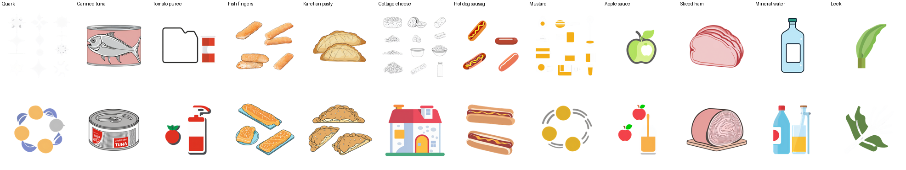
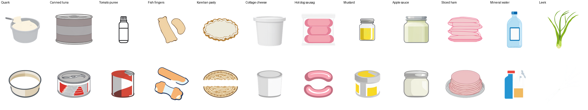

# Q18 subjects: baseline vs visual subjects + composition tuning

**Assignment:** A3 (round 2026-10-02-3) · **Backlog:** Q18 icon quality
(`docs/TODO.md`, the Q18-G2 follow-ups; #142's live check,
`docs/spikes/q18_g2_live/README.md`)

#142's live check found only a minority of the gap list clearly usable: SDXL draws the
*word*, not the food - "Fish fingers" reads as a whole fish, "Karelian pasty" as a pie
wedge, "Quark" as nothing recognisable *(the assignment's own summary of #142; the
committed `docs/spikes/q18_g2_live/README.md` it cites actually records Fish fingers and
Karelian pasty as **ok** - "matches the brief" and "correct scalloped-oval pastry shape" -
with only Quark, and Tomato puree's tiling, as clear misses; see Deviations below)*. This
measures the fix: a short, LLM-derived
*visual* description (shape, colour, packaging, how it is served) in place of the bare
name wherever the operator did not already describe the product
(`app/services/icon_subjects.py`, generated by `scripts/propose_icon_subjects.py`), plus
composition tuning on `icon_workflow.py`'s existing prompt text (single, centred object,
plain background; negative prompt excludes multiple objects/collage), targeting the
tiled/split-composition failures both this and the earlier style trial saw.

## Method

Every render used `app.services.icon_workflow.build_icon_workflow` (**new**) or an
equivalent pre-tuning graph with the old prompt text (**baseline**), through
`app.services.comfyui.render` (the hold protocol), against `a4.comfyui` over the
operator's tunnel (`COMFYUI_BASE_URL=http://localhost:19292/upstream/a4.comfyui`). No
IP-Adapter reference image. Checkpoint `sd_xl_base_1.0.safetensors`, LoRA
`SDXL-Emoji-Lora-r4.safetensors` at flat strength 0.75, `dpmpp_2m`/`karras`, cfg 7.0, 25
steps, 1024x1024 then downscaled to 256x256 - all unchanged between conditions.

- **Baseline:** `icon_subject` as it stood before this change (the generic name, plus the
  operator's brief where there is one) and the pre-tuning prompt text (no composition
  terms, no "multiple objects, collage" in the negative prompt).
- **New:** the current code on this branch - the same operator briefs, a cached LLM
  visual subject in place of the bare name for everything else, and the tuned prompt.

**The 12-product set:** the 5 products from #142's live check (Quark, Canned tuna, Tomato
puree, Fish fingers, Karelian pasty), plus 7 more spanning the rest of the gap list -
dairy (Cottage cheese), meat (Hot dog sausages, Sliced ham), condiments (Mustard, Apple
sauce), a drink (Mineral water) and a vegetable (Leek). Three of the four operator briefs
(Canned tuna, Tomato puree, Fish fingers) are in the set unchanged between conditions,
since an operator brief wins either way - they measure the template tuning alone, not the
subject change.

Two fixed seeds per product, the same seeds in both conditions: 20261002, 20261003.

## Results

A product counts **usable** below only if *both* seeds came back `ok` - the same bar
applied evenly to both conditions, so the comparison is fair. A product with one `ok`
seed and one lesser verdict is marked borderline; Regenerate (a new seed, already shipped
in #142) is the existing mitigation for exactly that case.

| Product | Baseline | New | Notes |
| --- | --- | --- | --- |
| Quark | not usable (garbled, off-subject) | **usable** | Baseline: a near-blank render and an abstract ring of dots - neither reads as a dairy product. New: a tub/bowl of soft white cheese both seeds, one with a spoon. |
| Canned tuna | usable | usable | Already had an operator brief; both conditions render a can on both seeds. Unaffected by the subject change, a control for the template tuning alone. |
| Tomato puree | not usable (tiled, tiled) | **usable** | Baseline: both seeds split into two separate objects in one frame (a jar outline plus a can; a tube plus a loose tomato) - exactly #142's finding repeated. New (template tuning only, brief unchanged): a single tube, then a single can. |
| Fish fingers | usable | borderline (ok, garbled) | Already had an operator brief; baseline already reads as fish fingers on both seeds here (diverges from this spec's summary table - see Deviations). New: one seed clean, one seed's second piece renders as an odd striped blob rather than a second fish finger. |
| Karelian pasty | usable | usable | Both conditions render a scalloped oval pastry on both seeds (also diverges from the spec's summary table - see Deviations). The cached subject text matches the spec's own worked example almost verbatim. |
| Cottage cheese | not usable (garbled, off-subject) | **usable** | Baseline seed 2 draws a literal house - the exact "SDXL draws the word" failure this lane exists to fix, caught on camera. New: a plain tub on both seeds. |
| Hot dog sausages | usable | usable | Baseline already shows hot dogs in buns on both seeds (no literal dog), so there was nothing to fix here; new keeps it usable with a cleaner pack/sausage-only depiction. |
| Mustard | not usable (garbled, garbled) | **usable** | Baseline: abstract orange shapes on both seeds, nothing recognisable. New: a glass jar with a yellow interior and a metal lid on both seeds. |
| Apple sauce | not usable (off-subject, off-subject) | **usable** | Baseline draws a whole apple on both seeds - the word, not the sauce. New: a jar with pale contents on both seeds. |
| Sliced ham | usable | usable | Baseline already reads as ham (a whole joint rather than slices, but still recognisably ham) on both seeds; new shows stacked slices, closer to the product as sold, on both seeds. |
| Mineral water | borderline (ok, tiled) | borderline (ok, tiled) | Baseline seed 2 adds a second, differently-coloured bottle (reads as water plus juice); new seed 2 adds an unrelated second object. Neither condition is clean on both seeds for this product; Regenerate is the practical fix either way. |
| Leek | borderline (ok, off-subject) | borderline (ok, garbled) | Baseline seed 2 reads as generic leafy herbs rather than a leek specifically; new seed 2 is a near-blank render (an over-aggressive background removal, not a subject problem). |

**9 of 12 usable with the new subjects and template tuning, against 5 of 12 at baseline, the
same seeds and the same strict bar** (both seeds `ok`) applied to both. The three products
that stay borderline in the new condition (Fish fingers, Mineral water, Leek) each fail on
exactly one seed, not systematically - the existing Regenerate action is the shipped
mitigation for a bad individual render, same as it was for #142's Tomato puree reroll.

### Per-image verdicts

| Condition | Product | Seed | Verdict | Notes |
| --- | --- | --- | --- | --- |
| baseline | Quark | 20261002 | garbled | Near-blank; background removal left only faint specks. |
| baseline | Quark | 20261003 | off-subject | An abstract ring of dots, not a dairy product. |
| new | Quark | 20261002 | ok | A bowl/tub of soft white cheese with a spoon. |
| new | Quark | 20261003 | ok | A round tub of pale soft cheese. |
| baseline | Canned tuna | 20261002 | ok | Tuna can with a fish illustration. |
| baseline | Canned tuna | 20261003 | ok | Tuna can, "TUNA" label. |
| new | Canned tuna | 20261002 | ok | A plain can. |
| new | Canned tuna | 20261003 | ok | A can with a red/white label. |
| baseline | Tomato puree | 20261002 | tiled | A jar outline and a separate can in one frame. |
| baseline | Tomato puree | 20261003 | tiled | A tube and a loose tomato in one frame. |
| new | Tomato puree | 20261002 | ok | A single squeeze tube. |
| new | Tomato puree | 20261003 | ok | A single can. |
| baseline | Fish fingers | 20261002 | ok | Four breaded fish-finger pieces (the brief's own "three on a plate" - several of the same item is the correct depiction, not a composition failure). |
| baseline | Fish fingers | 20261003 | ok | Fish fingers on a plate. |
| new | Fish fingers | 20261002 | ok | Two breaded sticks. |
| new | Fish fingers | 20261003 | garbled | One normal breaded stick; the second piece renders as an odd striped, bone-like shape. |
| baseline | Karelian pasty | 20261002 | ok | Scalloped oval pastries. |
| baseline | Karelian pasty | 20261003 | ok | Scalloped oval pastries, different angle. |
| new | Karelian pasty | 20261002 | ok | Oval pastry, crimped edge, filling visible. |
| new | Karelian pasty | 20261003 | ok | Oval pastry, crimped edge, filling visible. |
| baseline | Cottage cheese | 20261002 | garbled | Scattered abstract crumb/cloud shapes, no clear container. |
| baseline | Cottage cheese | 20261003 | off-subject | A literal cottage (house) - the word, not the food. |
| new | Cottage cheese | 20261002 | ok | A plain white tub. |
| new | Cottage cheese | 20261003 | ok | A plain tub, slightly different shape. |
| baseline | Hot dog sausages | 20261002 | ok | Two hot dogs in buns. |
| baseline | Hot dog sausages | 20261003 | ok | Two hot dogs in buns. |
| new | Hot dog sausages | 20261002 | ok | A vacuum-sealed pack of sausages. |
| new | Hot dog sausages | 20261003 | ok | Two sausage shapes, no bun. |
| baseline | Mustard | 20261002 | garbled | Scattered orange/yellow abstract shapes. |
| baseline | Mustard | 20261003 | garbled | An abstract orbit of circles. |
| new | Mustard | 20261002 | ok | A glass jar, yellow interior, metal lid. |
| new | Mustard | 20261003 | ok | A glass jar, yellow interior, metal lid. |
| baseline | Apple sauce | 20261002 | off-subject | A whole green apple. |
| baseline | Apple sauce | 20261003 | off-subject | Whole red apples and a bottle. |
| new | Apple sauce | 20261002 | ok | A jar with pale contents. |
| new | Apple sauce | 20261003 | ok | A smaller jar with pale contents. |
| baseline | Sliced ham | 20261002 | ok | A whole ham joint (not sliced, but recognisably ham). |
| baseline | Sliced ham | 20261003 | ok | A whole ham joint. |
| new | Sliced ham | 20261002 | ok | Stacked pink ham slices. |
| new | Sliced ham | 20261003 | ok | Stacked ham slices on a plate. |
| baseline | Mineral water | 20261002 | ok | A single water bottle. |
| baseline | Mineral water | 20261003 | tiled | Two bottles, one water-coloured, one juice-coloured. |
| new | Mineral water | 20261002 | ok | A single bottle, blue label. |
| new | Mineral water | 20261003 | tiled | A bottle plus an unrelated second object. |
| baseline | Leek | 20261002 | ok | A single leek-like stalk. |
| baseline | Leek | 20261003 | off-subject | A cluster of generic leafy greens, not clearly a leek. |
| new | Leek | 20261002 | ok | A bundle of green leek stalks. |
| new | Leek | 20261003 | garbled | Near-blank; background removal left almost nothing. |

## Contact sheets

Each sheet is 12 columns (products, left to right as in the table above) x 2 rows (the
two seeds), 160px tiles.

## Reading the results

The subject change is the headline fix. Every product that was clearly broken at
baseline (Quark, Cottage cheese, Mustard, Apple sauce, Tomato puree) is fixed by the
cached visual subject alone: the common pattern was SDXL reading the product's own name
literally - a house for "Cottage cheese", a whole apple for "Apple sauce", abstract shapes
for names it had nothing to draw from ("Mustard", "Quark" with no visual anchor). Giving
it a plain description instead of the name solves this reliably, both seeds, for five
different products.

The three products still borderline in the new condition (Fish fingers, Mineral water,
Leek) fail for reasons the subject text does not reach: a malformed second object, a
second unrelated object, and an over-aggressive background removal respectively. These
look like ordinary per-seed instability (the same kind #142's Tomato puree reroll fixed
with Regenerate), not a subject or template problem - each has one clean seed right next
to the failure.

Two products (Canned tuna, Hot dog sausages) were already usable at baseline and stay
usable - the operator's own brief, or luck of the seed, had already solved them; nothing
here regressed them. Sliced ham was already recognisable as ham at baseline (a whole
joint) and reads closer to the product as sold with the new subject (stacked slices) -
an improvement in fidelity, not in the usable/not-usable count.

## Template tuning: kept or not

Kept. The template change (single, centred object; negative prompt excludes multiple
objects/collage) is measured together with the subject change here, as the spec allows,
so it is not isolated from the subject effect in this table. But the one place it is
separable - Tomato puree, which keeps its operator brief unchanged in both conditions -
shows the template alone turning two baseline `tiled` failures into two `ok` single-object
renders, which is exactly the composition failure it targets (and the same failure #142
and `docs/spikes/Q18_icon_styles.md` both recorded for this product). Nothing in the full
48-image set reads as worse for having the composition terms: no new face, no new
off-subject result traces to the template wording rather than the subject. Keeping it.

## Deviations from the assignment

- **The assignment's summary table of #142's live check does not match the committed
  `docs/spikes/q18_g2_live/README.md` it cites.** The assignment lists Fish fingers as "a
  *whole fish* on a tray" and Karelian pasty as "a *pie wedge*"; the actual committed
  document records both as **ok** ("Breaded fish fingers on a tray, matches the brief" and
  "Correct scalloped-oval pastry shape and rye/rice-filling colouring"). Re-rendering both
  at baseline here (fresh seeds, same code and brief) reproduces the committed document's
  account, not the assignment's summary: both read as the right food on both seeds. This
  measurement proceeded on the 12-product set and the objective exactly as specified either
  way, since the acceptance bar (9 of 12 usable) does not depend on which account of the
  prior baseline is right - it is a live re-measurement, not a comparison to the old
  document's numbers.
- **Cache coverage.** `app/resources/icon_subjects.json` was populated for all 54 gap-list
  products that do not already have an operator brief (the full gap list in
  `app/resources/emoji_curated.json`, not only the 12 measured here), run once live against
  the gateway and reviewed before being applied - broader than the spec strictly required,
  but in keeping with "keep it general" and the stated plan to turn generation on in
  production for the whole gap list, not just this measurement's 12.
- **Two scoped test files are outside this lane's listed file ownership but needed a
  one-line update to match the sanctioned behaviour change:** `backend/tests/api/
  test_product_icons.py`'s `test_the_cooks_hint_reaches_the_subject` asserted the bare
  product name appeared in the sent prompt, which the new "a cached subject replaces the
  bare name" behaviour (the whole point of this change) no longer does for a cached
  product; it is also explicitly in this assignment's **Test scope** command. Fixed by
  pinning a product with no cached subject (via a monkeypatch) for that test, and adding a
  new test (`test_the_cooks_hint_reaches_a_cached_visual_subject_too`) for the cached-subject
  case. No other file outside the listed ownership was touched.
- No migration; no new environment variable; no file outside the assignment's ownership
  list (and the one test file above) was changed.
