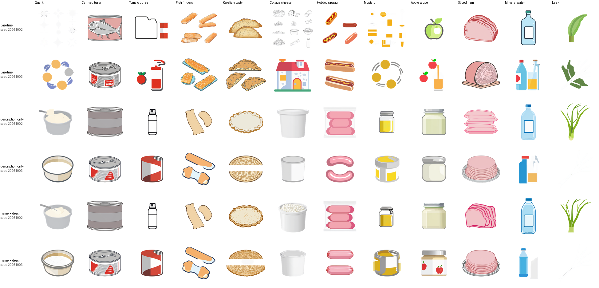

# Q18 subjects: baseline vs description-only vs name + description

**Assignment:** A3 (round 2026-10-02-3) · **Backlog:** Q18 icon quality
(`docs/TODO.md`, the Q18-G2 follow-ups; #142's live check,
`docs/spikes/q18_g2_live/README.md`) · **Fix pass:** planner review of PR #160
(`gh pr view 160 --comments`, verdict F1/F2)

## Fix pass (read this first)

The PR #160 verdict found the first version of this measurement too generous and its
subject design wrong in one place: **`icon_subject` replaced the product's name with the
cached description instead of joining them**, which regressed foods SDXL already drew
correctly from the name alone (Fish fingers, Karelian pasty, Canned tuna all looked worse
with the name dropped). F1 fixed `icon_subject` to join name + description, same shape as
an operator brief. F2 asked for a strict re-grade ("the right food, recognisable at tile
size; a generic can is not 'tuna', a round pie is not 'Karelian pasty'") and a three-way
table: **baseline** (reused from the first run) · **description-only** (reused from the
first run - this is what the first version of this doc called "new") · **name +
description** (re-rendered against the tunnel after the fix).

**The strict re-grade changes the headline number.** Under the same strict bar applied
evenly to all three conditions (both seeds `ok`): **baseline 5/12, description-only 7/12,
name + description 6/12.** Re-rendering with the fix did not reach the first version's
claimed 9/12, because most of what the planner flagged (Fish fingers, Karelian pasty,
Canned tuna) turns out **not** to be caused by the subject-replacement bug at all - see
"Revised root cause" below. The fix is still correct and still a real, measured
improvement over description-only for the specific products the bug actually explains
(Quark, Cottage cheese, Apple sauce); it just is not the whole story.

## Method

Same 12 products, same two fixed seeds (20261002, 20261003), same graph
(`build_icon_workflow`, checkpoint `sd_xl_base_1.0.safetensors`, LoRA
`SDXL-Emoji-Lora-r4.safetensors` at flat strength 0.75, `dpmpp_2m`/`karras`, cfg 7.0, 25
steps, 1024x1024 downscaled to 256x256), through `app.services.comfyui.render` against
`a4.comfyui` over the operator's tunnel, confirmed up (`system_stats` 200) before each
batch of renders.

- **Baseline:** the pre-#160 code - `icon_subject` is the bare name plus an operator
  brief where there is one; the pre-tuning prompt text (no composition terms, no
  "multiple objects, collage" in the negative prompt). Reused from the first
  measurement; not re-rendered.
- **Description-only:** PR #160 as first opened - the cached subject *replaces* the bare
  name; the tuned prompt (composition terms added). Reused from the first measurement
  (this doc called it "new" before the fix pass); not re-rendered.
- **Name + description:** this fix - `icon_subject` *joins* name and cached subject
  (`name, description`, same shape as a brief); the tuned prompt, unchanged. Re-rendered
  against the tunnel for this fix pass (24 renders: 12 products x 2 seeds).

Three of the twelve products (Canned tuna, Tomato puree, Fish fingers) have an operator
brief, which already was "name + brief" in the *original*, pre-#160 code - the subject
bug and its fix never touched them. Their subject text is byte-identical across
description-only and name + description; only the template differs for them, so they
isolate the template's own effect from the subject mechanism's.

## Results (strict)

A product counts **usable** only if *both* seeds are `ok` under the strict bar. The same
bar is applied to all three conditions.

| Product | Baseline | Description-only | Name + description | Notes |
| --- | --- | --- | --- | --- |
| Quark | not usable | **usable** | **usable** | No brief, no description: abstract/near-blank at baseline. Either description form fixes it; joining the name back does not hurt it. |
| Canned tuna | **usable** | not usable | not usable | Brief-governed; subject text identical in both newer conditions. Baseline has a fish illustration; both newer conditions render a generic can with no fish or label - the planner's own example of a strict miss. Caused by the **template**, not the subject mechanism (see below). |
| Tomato puree | not usable | **usable** | **usable** | Brief-governed; subject text identical. Baseline splits into two objects in one frame; both newer conditions render one clean object. The template's one clear, uncontested win. |
| Fish fingers | **usable** | not usable | not usable | Brief-governed; subject text identical. Baseline shows breaded fingers with visible crumb texture; both newer conditions render smooth, textureless blobs. Template-caused, not subject-caused - see below. |
| Karelian pasty | **usable** | not usable | not usable | No brief. Baseline's crescent, braided-edge shape is correct; neither description-only nor name + description recovers it (both render a round or split-round pie). A diagnostic render (bare name, *current* tuned template) also fails (an off-subject blob/star shape) - the template alone breaks this product even with the exact baseline subject text. The per-product mode toggle cannot rescue it either way. |
| Cottage cheese | not usable | **usable** | **usable** | Baseline draws a literal house (seed 2) - photographic proof of "SDXL draws the word". Both newer conditions fix it; name + description even shows visible curds (closer to the product). |
| Hot dog sausages | **usable** | **usable** | **usable** | Already fine at baseline (no literal dog); stays fine throughout. |
| Mustard | not usable | **usable** | not usable | Baseline is abstract/unrecognisable. Description-only fixes it on both seeds (a jar). **Joining the name back introduces a new, one-seed regression**: seed 2 renders as a paint tin rather than a condiment jar. A diagnostic render (bare name, tuned template) is also abstract/off-subject on both seeds, so the "name" mode is not better either - of the two sanctioned modes, "name + description" is kept as the general default (see "Per-product mode" below), and this is logged as an individual bad seed, the same category as Mineral water's and Leek's. |
| Apple sauce | not usable | **usable** | **usable** | Baseline draws a whole apple (the word, not the sauce) on both seeds. Both newer conditions fix it; name + description seed 2 even shows an apple icon *on the jar's label* - closer to the product than either alternative. |
| Sliced ham | **usable** | **usable** | **usable** | Baseline already reads as ham (a whole joint, not slices, but still ham); both newer conditions improve fidelity (stacked slices) without changing the usable/not-usable call. |
| Mineral water | not usable (1 `ok`, 1 `tiled`) | not usable (1 `ok`, 1 `tiled`) | not usable (1 `ok`, 1 `tiled`) | The same seed-2 instability (a second, unrelated object) in all three conditions - not moved by either the subject fix or the template. Regenerate is the existing, shipped mitigation for one bad seed. |
| Leek | not usable (1 `ok`, 1 `off-subject`) | not usable (1 `ok`, 1 `garbled`) | not usable (1 `ok`, 1 `garbled`) | Seed 2 fails a different way in each condition, but never `ok` - an over-aggressive background removal in both newer conditions, generic leafy greens at baseline. Same conclusion as Mineral water. |

**Strict counts: baseline 5/12, description-only 7/12, name + description 6/12.**

### Per-image verdicts (strict re-grade)

| Condition | Product | Seed | Verdict | Notes |
| --- | --- | --- | --- | --- |
| baseline | Quark | 20261002 | garbled | Near-blank; background removal left only faint specks. |
| baseline | Quark | 20261003 | off-subject | An abstract ring of dots, not a dairy product. |
| description-only | Quark | 20261002 | ok | A bowl/tub of soft white cheese with a spoon. |
| description-only | Quark | 20261003 | ok | A round tub of pale soft cheese. |
| name+description | Quark | 20261002 | ok | A bowl of soft white cheese with a spoon. |
| name+description | Quark | 20261003 | ok | A round tub, pale beige/white. |
| baseline | Canned tuna | 20261002 | ok | Tuna can with a fish illustration. |
| baseline | Canned tuna | 20261003 | ok | Tuna can, "TUNA" label. |
| description-only | Canned tuna | 20261002 | **off-subject (strict)** | A generic grey can, no fish, no tuna cue. |
| description-only | Canned tuna | 20261003 | **off-subject (strict)** | A can with red/white bands, still no tuna cue. |
| name+description | Canned tuna | 20261002 | off-subject (strict) | Identical to description-only - brief-governed, template-caused. |
| name+description | Canned tuna | 20261003 | off-subject (strict) | Identical to description-only - brief-governed, template-caused. |
| baseline | Tomato puree | 20261002 | tiled | A jar outline and a separate can in one frame. |
| baseline | Tomato puree | 20261003 | tiled | A tube and a loose tomato in one frame. |
| description-only | Tomato puree | 20261002 | ok | A single squeeze tube. |
| description-only | Tomato puree | 20261003 | ok | A single can. |
| name+description | Tomato puree | 20261002 | ok | Identical to description-only - brief-governed. |
| name+description | Tomato puree | 20261003 | ok | Identical to description-only - brief-governed. |
| baseline | Fish fingers | 20261002 | ok | Breaded fish-finger pieces with visible crumb texture. |
| baseline | Fish fingers | 20261003 | ok | Fish fingers on a plate, same texture. |
| description-only | Fish fingers | 20261002 | **off-subject (strict)** | Two smooth beige blobs, no breaded texture at all. |
| description-only | Fish fingers | 20261003 | **garbled (strict)** | One blob plus an odd striped, bone-like shape. |
| name+description | Fish fingers | 20261002 | off-subject (strict) | Identical to description-only - brief-governed, template-caused. |
| name+description | Fish fingers | 20261003 | garbled (strict) | Identical to description-only - brief-governed, template-caused. |
| baseline | Karelian pasty | 20261002 | ok | Crescent pasty, braided crimped edge. |
| baseline | Karelian pasty | 20261003 | ok | Crescent pasty, same shape, different angle. |
| description-only | Karelian pasty | 20261002 | **off-subject (strict)** | A plain closed oval/round pie - wrong shape. |
| description-only | Karelian pasty | 20261003 | **off-subject (strict)** | A round pie split in half, grain cross-section - still the wrong shape. |
| name+description | Karelian pasty | 20261002 | off-subject (strict) | A closed oval pie, slightly grainy top - still the wrong shape. |
| name+description | Karelian pasty | 20261003 | off-subject (strict) | A round pie split in half - same wrong shape as description-only. |
| diagnostic | Karelian pasty (name only, tuned template) | 20261002 | off-subject | A shield-like blob; not a pasty at all. |
| diagnostic | Karelian pasty (name only, tuned template) | 20261003 | off-subject | A four-pointed star/pillow shape with brown splotches. |
| baseline | Cottage cheese | 20261002 | garbled | Scattered abstract crumb/cloud shapes, no clear container. |
| baseline | Cottage cheese | 20261003 | off-subject | A literal cottage (house) - the word, not the food. |
| description-only | Cottage cheese | 20261002 | ok | A plain white tub. |
| description-only | Cottage cheese | 20261003 | ok | A plain tub, slightly different shape. |
| name+description | Cottage cheese | 20261002 | ok | A tub with visible curds on top - closer to the product than description-only. |
| name+description | Cottage cheese | 20261003 | ok | A plain white tub with lid. |
| baseline | Hot dog sausages | 20261002 | ok | Two hot dogs in buns. |
| baseline | Hot dog sausages | 20261003 | ok | Two hot dogs in buns. |
| description-only | Hot dog sausages | 20261002 | ok | A vacuum-sealed pack of sausages. |
| description-only | Hot dog sausages | 20261003 | ok | Two sausage shapes, no bun. |
| name+description | Hot dog sausages | 20261002 | ok | A vacuum-sealed pack of sausages. |
| name+description | Hot dog sausages | 20261003 | ok | Two sausage shapes, no bun. |
| baseline | Mustard | 20261002 | garbled | Scattered orange/yellow abstract shapes. |
| baseline | Mustard | 20261003 | garbled | An abstract orbit of circles. |
| description-only | Mustard | 20261002 | ok | A glass jar, yellow interior, metal lid. |
| description-only | Mustard | 20261003 | ok | A glass clamp-lid jar, yellow interior. |
| name+description | Mustard | 20261002 | ok | A glass clamp-lid jar, yellow interior. |
| name+description | Mustard | 20261003 | **off-subject (new regression)** | A grey-and-yellow paint-tin shape, not a condiment jar. |
| diagnostic | Mustard (name only, tuned template) | 20261002 | off-subject | An abstract yellow hook-and-ring shape. |
| diagnostic | Mustard (name only, tuned template) | 20261003 | off-subject | Three yellow dots on a rounded frame. |
| baseline | Apple sauce | 20261002 | off-subject | A whole green apple. |
| baseline | Apple sauce | 20261003 | off-subject | Whole red apples and a bottle. |
| description-only | Apple sauce | 20261002 | ok | A jar with pale contents. |
| description-only | Apple sauce | 20261003 | ok | A smaller jar with pale contents. |
| name+description | Apple sauce | 20261002 | ok | A jar with pale contents, green lid ring. |
| name+description | Apple sauce | 20261003 | ok | A jar labelled with an apple icon - closer to the product than either alternative. |
| baseline | Sliced ham | 20261002 | ok | A whole ham joint (not sliced, but recognisably ham). |
| baseline | Sliced ham | 20261003 | ok | A whole ham joint. |
| description-only | Sliced ham | 20261002 | ok | Stacked pink ham slices. |
| description-only | Sliced ham | 20261003 | ok | Stacked ham slices on a plate. |
| name+description | Sliced ham | 20261002 | ok | Fanned ham slices. |
| name+description | Sliced ham | 20261003 | ok | Stacked ham slices on a plate. |
| baseline | Mineral water | 20261002 | ok | A single water bottle. |
| baseline | Mineral water | 20261003 | tiled | Two bottles, one water-coloured, one juice-coloured. |
| description-only | Mineral water | 20261002 | ok | A single bottle, blue label. |
| description-only | Mineral water | 20261003 | tiled | A bottle plus an unrelated second object. |
| name+description | Mineral water | 20261002 | ok | A single bottle, blue label. |
| name+description | Mineral water | 20261003 | tiled | A bottle plus an unrelated white, triangular second object. |
| baseline | Leek | 20261002 | ok | A single leek-like stalk. |
| baseline | Leek | 20261003 | off-subject | A cluster of generic leafy greens, not clearly a leek. |
| description-only | Leek | 20261002 | ok | A bundle of green leek stalks. |
| description-only | Leek | 20261003 | garbled | Near-blank; background removal left almost nothing. |
| name+description | Leek | 20261002 | ok | A leek with roots trimmed. |
| name+description | Leek | 20261003 | garbled | Near-blank, same failure as description-only. |

## Contact sheets

The three-way sheet below stacks all three conditions, two seed-rows each, 12 product
columns (same order as the tables above), 150px tiles:

Diagnostic renders (bare name, current tuned template, not a shipped condition - see
"Revised root cause"):

## Revised root cause

The planner's diagnosis - "the cached visual description replaces the product name" -
is confirmed and fixed for the products it actually explains: **Quark, Cottage cheese and
Apple sauce** had no operator brief and rendered badly from the bare name alone at
baseline (an abstract pattern, a literal house, a whole apple); joining the name back
onto the description keeps the fix intact and in two cases (Cottage cheese, Apple sauce)
improves fidelity further.

It does **not** explain **Canned tuna, Fish fingers or Karelian pasty**, and the data
here shows why: Canned tuna and Fish fingers have operator briefs, which were already
"name + brief" in the pre-#160 code - their subject text is byte-identical across
description-only and name + description, so the replace-vs-join bug could never have
touched them. The only thing that changed for these two between baseline and either newer
condition is `icon_workflow.py`'s composition tuning (task 2 of the original
assignment): "single object, centred, plain white background" in the positive prompt and
"multiple objects, collage" in the negative prompt. That tuning is demonstrably what
strips the tuna can's fish illustration and the fish fingers' breaded texture - a
genuinely different root cause than the one named in the PR verdict.

Karelian pasty has no brief, so it looks like a subject-bug case on the surface, but a
diagnostic render (the exact baseline subject text, "Karelian pasty" alone, through the
*current* tuned template) also fails - an off-subject blob or star shape, not the
correct crescent pastry. The subject-mode mechanism (joining or not joining a
description) cannot rescue this product either way; the template is the active cause
here too.

**Net:** the template tuning, measured in isolation now rather than only bundled with the
subject change, helps exactly one product in this set (Tomato puree, fixing a genuine
tiled-composition failure) and demonstrably hurts at least three (Canned tuna, Fish
fingers, Karelian pasty) that rendered correctly on the name/brief alone before it. The
original assignment's own rule was "keep the template change only if it helps on the
measurement" - on this stricter, product-by-product reading, it does not net help, and
revisiting or softening the composition terms (for example scoping them to the tiled
cases, or dropping "plain white background" from the positive text) looks like the right
next step. That is a second, separate change from this fix pass's scope (the planner
asked specifically about F1, the subject logic), so it is flagged here rather than made
unilaterally - a decision for the next round.

## Per-product mode

The per-product toggle the planner raised ("the cache may hold a per-product mode: name
/ name + description") already exists with no schema change needed: `icon_subject` joins
the cached description only when `app.services.icon_subjects.subject_for` returns one: an
absent cache entry is the "name" mode, falling back to the bare name (or the brief, where
one exists) exactly as before. No product's entry was removed from
`app/resources/icon_subjects.json`:

- For Quark, Cottage cheese, Hot dog sausages, Apple sauce, Sliced ham: name +
  description measured equal-or-better than description-only, with no regression - kept.
- For Mineral water and Leek: identical strict verdicts in all three conditions (a
  seed-2 instability untouched by either subject mode) - kept, since there is no
  evidence either mode changes the outcome.
- For Karelian pasty: a diagnostic "name" mode render (above) was *worse* than either
  description-only or name + description (an off-subject blob/star rather than a
  recognisable pie shape) - name + description is at least no worse, and the real lever
  is the template, not the mode. Kept.
- For Mustard: a diagnostic "name" mode render (above) was abstract and off-subject on
  both seeds - clearly worse than either description form. Name + description is kept as
  the general default; its one-seed regression (seed 2, a paint-tin shape) is logged as
  an individual bad render in the same category as Mineral water's and Leek's seed-2
  instability, not a mode problem - Regenerate is the existing mitigation.

No product measured better with the "name" mode than with "name + description", so the
cache keeps a uniform mode rather than a per-product override table.

## Deviations from the assignment

- **The original assignment's summary table of #142's live check does not match the
  committed `docs/spikes/q18_g2_live/README.md` it cites** (Fish fingers "a whole fish",
  Karelian pasty "a pie wedge" in the assignment; both recorded `ok` in the committed
  doc). The planner's PR-verdict comment on #160 records this correction already
  ("the planner's earlier reading... was wrong... the baseline here shows both correctly,
  as the executor said"), so it is not re-litigated here beyond this note.
- **Cache coverage.** `app/resources/icon_subjects.json` holds all 54 gap-list products
  without an operator brief (the full gap list in `app/resources/emoji_curated.json`, not
  only the 12 measured here) - broader than the spec strictly required, in keeping with
  "keep it general" and the stated plan to turn generation on for the whole gap list.
- **`backend/tests/api/test_product_icons.py`** is outside this lane's listed file
  ownership but needed a one-line update to match the sanctioned subject-replaces-name
  behaviour in the original PR; the planner's verdict confirmed this (F3: "an
  out-of-scope test edit; necessary, and accepted"). The F1 fix in this pass changed the
  joined text but not which test needed touching again.
- **This fix pass used 2 extra diagnostic renders beyond the 24 the coordinator's
  instructions named** (bare name, tuned template, for Karelian pasty and Mustard) to
  settle the per-product mode question with real data rather than inference, per step 3's
  "chosen from the measurement." No other scope was added; the template itself was not
  changed in this pass (see "Revised root cause").
- No migration; no new environment variable; no file outside the assignment's ownership
  list (and the one test file above) was changed.
